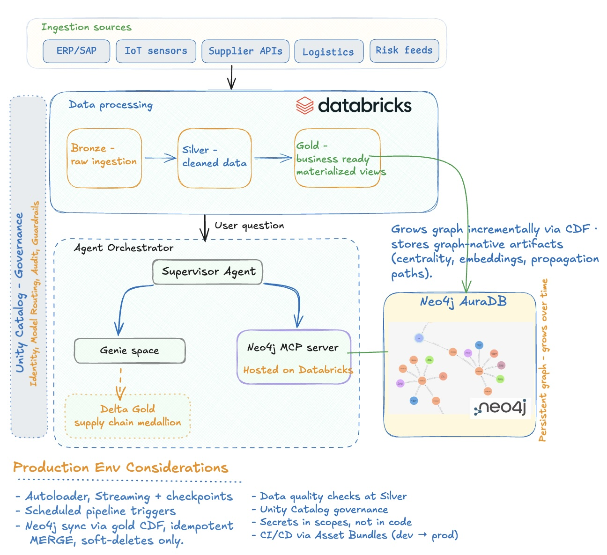
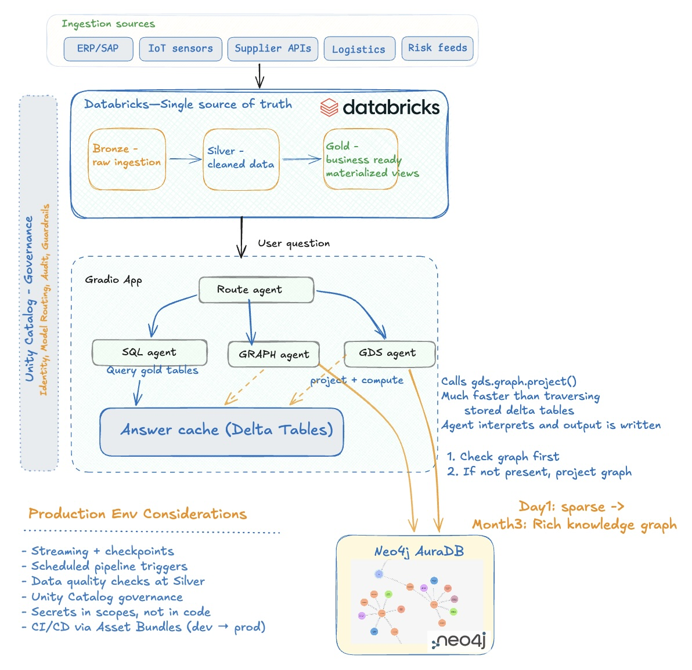
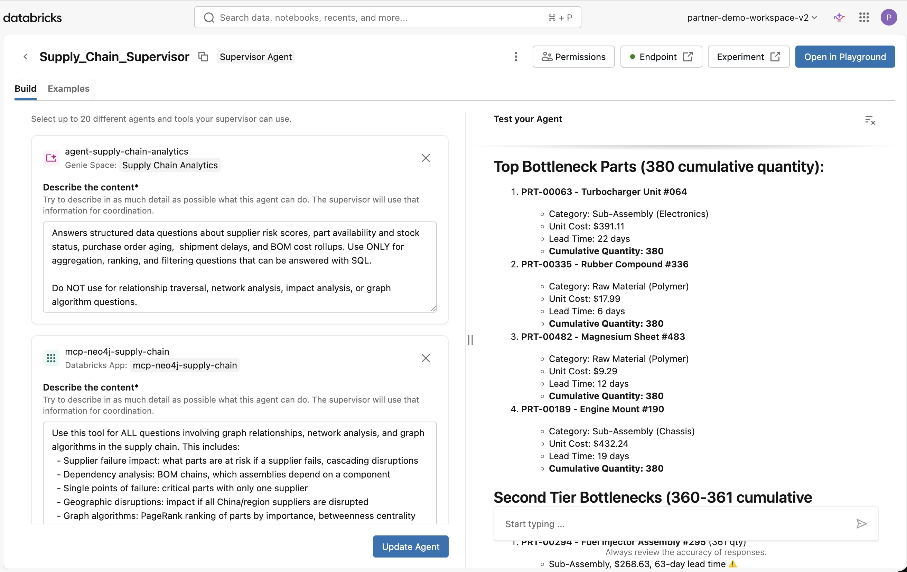
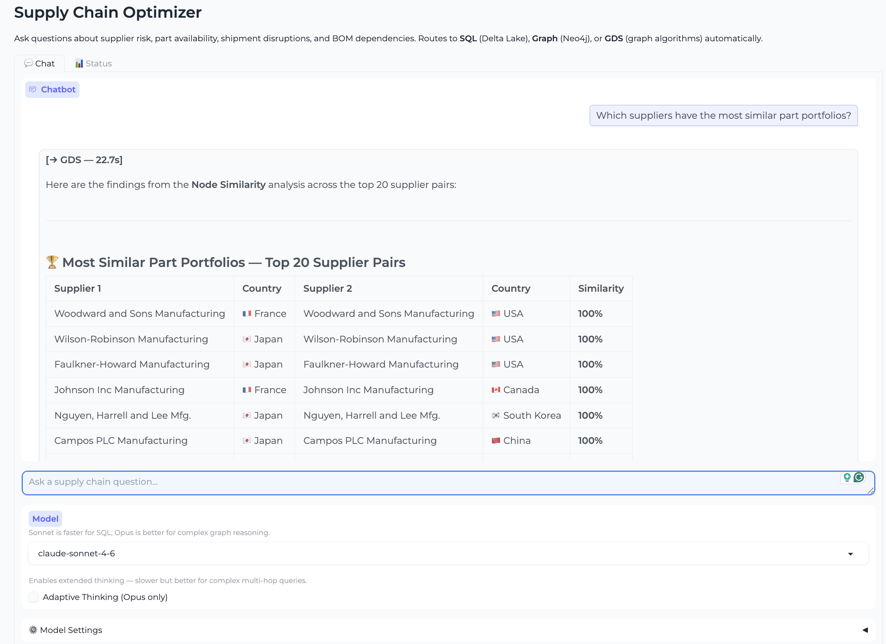
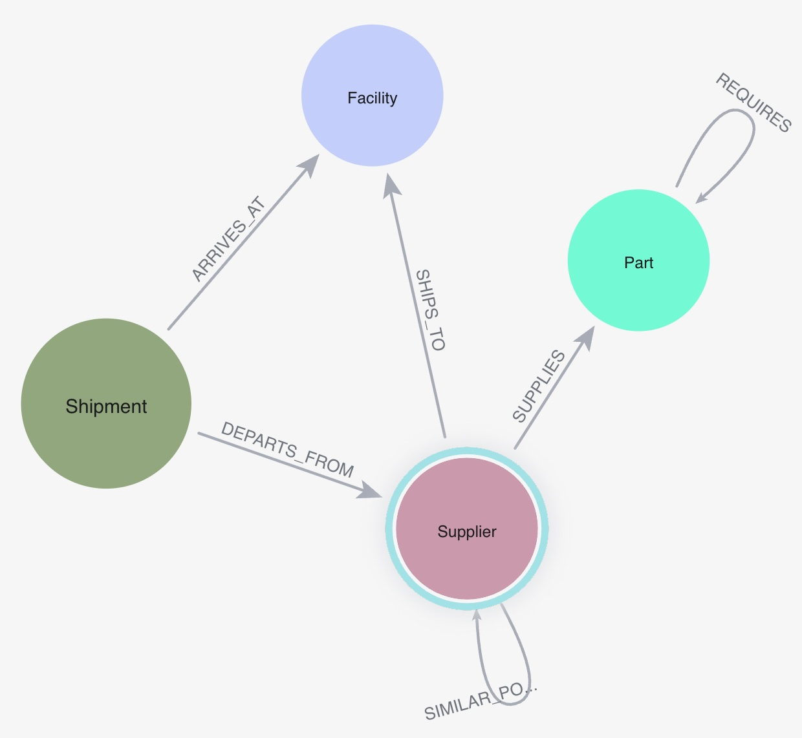

# Graph-Powered Supply Chain Analytics on Databricks

[]()
[]()
[]()
[]()
[]()
[]()
[]()
[]()

An AI-powered supply chain risk and disruption analysis tool built on Databricks. Answers natural-language questions about supplier risk, part availability, shipment disruptions, and BOM dependencies — routing intelligently between SQL (Delta Lake), graph traversal (Neo4j AuraDB), and graph algorithms (Neo4j GDS).

> - **SQL alone isn't enough** — questions like "what happens if this supplier fails?" require graph traversal across BOM dependencies, not aggregations on flat tables
> - **Neo4j GDS on AuraDB** runs PageRank, community detection, and shortest path directly on the graph in memory — far faster than recomputing from Delta tables on every query
> - **AgentBricks Supervisor + MCP** means no custom routing code — the Supervisor picks the right tool (Genie for SQL, Neo4j MCP for graph) based on the question, with Unity Catalog handling governance end-to-end

---

## Architecture

<details open>
<summary><strong>Architecture 1 — AgentBricks Supervisor</strong></summary>



AgentBricks Supervisor routes between Genie Space (SQL/Delta) and the Neo4j MCP server (graph + GDS algorithms), hosted as a Databricks App. Unity Catalog provides governance, model routing, and audit across the full stack.

```
Lakeflow Medallion Pipeline (scheduled)
        ↓
Gold Delta Tables
        ↓
project_graph.py (Databricks Job Task — runs after pipeline)
        ↓
Neo4j AuraDB (idempotent MERGE — nodes + relationships kept in sync)
        ↓
User Question → AgentBricks Supervisor
  ├── Genie Space        →  SQL against gold Delta tables   →  Answer
  └── Neo4j MCP Server   →  Cypher + GDS algorithms         →  Answer
```

</details>

<details>
<summary><strong>Architecture 2 — Gradio App (Interactive)</strong></summary>



Route agent inside the Gradio app classifies each question and dispatches to SQL, Graph, or GDS agent. Graph is projected lazily from Delta gold tables on first use and persists in AuraDB. Answers are cached in a Delta table with a 24h TTL.

```
Synthetic Data → Lakeflow Pipeline → Gold Delta Tables
        ↓
User Question → Router Agent (Claude)
  ├── SQL Agent    →  spark.sql() on gold tables       →  Answer
  ├── Graph Agent  →  lazy project → Neo4j Cypher      →  Answer
  └── GDS Agent    →  gds.graph.project() → algorithm  →  Answer
        ↓
Delta Answer Cache (TTL 24h)
```

</details>

---

## Tech Stack

| Layer | Technology |
|-------|-----------|
| Data platform | Databricks (Serverless) |
| Storage | Delta Lake |
| Governance & lineage | Unity Catalog — data lineage, secret scopes, UC functions, model registry |
| Pipeline | Lakeflow Spark Declarative Pipelines (SQL) |
| Agent orchestration | AgentBricks / Mosaic AI — Supervisor routing between tools |
| Natural language SQL | Genie Space — SQL Q&A against gold Delta tables |
| Agent framework | Claude Opus 4.6 / Sonnet 4.6 / Haiku 4.5 (Anthropic SDK) — tool use, adaptive thinking |
| Graph protocol | MCP (Model Context Protocol) — Neo4j MCP server hosted on Databricks Apps |
| Graph algorithms | Neo4j GDS (PageRank, Betweenness Centrality, Louvain, Node Similarity, WCC, Dijkstra) |
| Graph database | Neo4j AuraDB |
| Application hosting | Databricks Apps (Serverless Compute) |
| UI framework | Gradio (`gr.ChatInterface`) |
| Orchestration | Databricks Asset Bundles (DAB) |
| Data generation | Spark + Faker + Pandas UDFs |

---

<details>
<summary><strong>Agent Routing & Example Questions</strong></summary>

| Question Type | Route | Example |
|--------------|-------|---------|
| Risk scores, rankings | SQL | "Which suppliers have Critical risk?" |
| Stock status, availability | SQL | "What is the stock status for critical parts?" |
| PO aging, exposure | SQL | "Show delayed POs over 30 days old" |
| Shipment delays | SQL | "Which shipments have High disruption severity?" |
| BOM cost rollup | SQL | "What are the top 10 most expensive assemblies?" |
| Impact if X fails | **Graph** | "What parts are at risk if SUP-00094 fails?" |
| Dependency chains | **Graph** | "Which assemblies depend on this component?" |
| Single points of failure | **Graph** | "Which critical parts have only one supplier?" |
| Cascading disruptions | **Graph** | "What happens if all China suppliers are disrupted?" |
| Bottleneck / centrality | **GDS** | "Which parts are the biggest structural bottlenecks?" |
| Network-wide scoring | **GDS** | "Rank parts by how many assemblies depend on them (PageRank)" |
| Cluster / community detection | **GDS** | "Which supplier-part clusters are most exposed to risk?" |
| Node similarity | **GDS** | "Which suppliers have the most similar part portfolios?" |
| Weighted shortest path | **GDS** | "What is the least-delay sourcing path to this assembly?" |
| Disconnected components | **GDS** | "Are there isolated parts in the BOM?" |

**SQL — Delta Lake**
```
Which suppliers have Critical risk scores?
Show me all delayed purchase orders over 30 days old
What are the top 10 most expensive BOM assemblies?
Which shipments have High or Critical disruption severity?
What is the stock status for critical parts?
```

**Graph — Neo4j Cypher traversal**
```
What parts are at risk if our highest-risk supplier fails?
Which critical parts have only a single supplier?
What assemblies would be affected if Tier-1 suppliers from China are disrupted?
Show me the most depended-upon components in the BOM network
Which carrier routes have the most disrupted shipments?
```

**GDS — Neo4j Graph Algorithms**
```
Which parts are the biggest structural bottlenecks in the BOM? (Betweenness Centrality)
Rank parts by how many assemblies depend on them using PageRank
Which suppliers have the most similar part portfolios? (Node Similarity)
Detect supplier-part communities — which clusters are most exposed to risk? (Louvain)
Which facilities are the most critical routing hubs in the shipment network?
Are there any isolated or disconnected parts in the BOM? (WCC)
```

</details>

---

## AgentBricks Supervisor

The Supervisor routes questions between two tools: **Genie Space** (SQL/Delta) and the **Neo4j MCP server** (graph traversal + GDS algorithms). The screenshot below shows both tools configured, with a live PageRank result on the right.

> [!NOTE]
> The Neo4j MCP server is the preferred approach for all graph and GDS questions. It executes Cypher and GDS algorithms directly against AuraDB with no intermediate layers, no response format constraints, and no cold-start latency — producing richer, more accurate answers than the MLflow serving endpoint route.



| Tool | Type | Handles |
|------|------|---------|
| `agent-supply-chain-analytics` | Genie Space | Risk scores, PO aging, stock status, shipment delays, BOM cost rollups |
| `mcp-neo4j-supply-chain` | Databricks App (MCP) | Supplier failure impact, BOM dependency chains, PageRank, community detection, shortest path |

> [!IMPORTANT]
> **Prerequisite:** The Neo4j MCP server reads directly from AuraDB at query time — the graph must be populated before using the Supervisor. Run the `supply_chain_full_pipeline` job (pipeline + `project_graph.py`) at least once to load nodes and relationships into AuraDB.

---

## Application Running on Databricks Apps

The Gradio app runs entirely on Databricks serverless compute — no external hosting needed. Includes a model selector (Opus / Sonnet / Haiku), adaptive thinking toggle, and a 3-way router that dispatches each question to the right agent (SQL, Graph, or GDS).



---

> [!TIP]
> **For Developers:** Want this running in your own Databricks workspace? The fastest path is the [Databricks AI Dev Kit](https://github.com/databricks-solutions/ai-dev-kit) — works with Claude Code or Cursor, handles scaffolding and deployment end-to-end. Manual steps below if you'd rather set it up yourself.

---

<details>
<summary><strong>Data Model</strong></summary>

The dataset simulates a mid-size manufacturer sourcing parts from a global supplier network. Suppliers span multiple countries and tiers, parts range from raw materials to sub-assemblies, and shipments flow through regional facilities. All data is synthetically generated using Faker + Spark — realistic enough to demonstrate real supply chain risk patterns like cascading disruptions, single points of failure, and geographic concentration risk.

### Synthetic Domain Entities

| Entity | Count | Key Fields |
|--------|-------|-----------|
| Suppliers | 200 | `SUP-XXXXX`, tier (Tier-1/2/3), reliability_score, country |
| Parts | 500 | `PRT-XXXXX`, category (Raw Material / Sub-Assembly / Component), is_critical |
| Facilities | 50 | `FAC-XXXXX`, facility_type (Manufacturing / Assembly / Warehouse), region |
| BOM | ~2,000 | `BOM-XXXXX`, parent→child part relationships |
| Purchase Orders | 8,000 | `PO-XXXXXXX`, status (Open / In-Transit / Received / Delayed / Cancelled) |
| Shipments | ~12,000 | `SHP-XXXXXXXX`, carrier (5 carriers, Pareto dist), delay_days |

### Gold Tables

| Table | Description |
|-------|-------------|
| `gold_supplier_risk` | Composite risk score (reliability 40% + PO problem rate 35% + shipment issues 25%), risk_tier |
| `gold_part_availability` | Ordered vs received qty per part/facility, stock_status |
| `gold_active_purchase_orders` | Open/delayed POs with aging buckets and exposure_score |
| `gold_shipment_pipeline` | In-transit/delayed shipments with disruption_severity and route_key |
| `gold_bom_explosion` | 2-level BOM flattening with cumulative_quantity and rolled_up_cost_usd |

### Neo4j Graph Schema



```
(:Supplier)-[:SUPPLIES {po_count, avg_delay_days}]->(:Part)
(:Part)-[:REQUIRES {quantity, depth}]->(:Part)
(:Supplier)-[:SHIPS_TO {carrier, route_key}]->(:Facility)
(:Shipment)-[:DEPARTS_FROM]->(:Supplier)
(:Shipment)-[:ARRIVES_AT]->(:Facility)
```

### GDS Projections

| GDS Projection | Nodes | Relationships | Algorithms |
|----------------|-------|---------------|------------|
| `bom_network` | Part | REQUIRES (weight: cumulative_quantity) | PageRank, Betweenness Centrality, WCC, Shortest Path |
| `supply_risk_network` | Supplier + Part | SUPPLIES (weights: po_count, avg_delay_days) | Node Similarity, Louvain Community Detection, Weighted Shortest Path |
| `facility_network` | Supplier + Facility | SHIPS_TO | Betweenness Centrality, Louvain, Shortest Path |

</details>

<details>
<summary><strong>Setup</strong></summary>

### Prerequisites

| Requirement | Notes |
|-------------|-------|
| Databricks workspace | Serverless compute + Unity Catalog + Databricks Apps enabled |
| Databricks CLI | v0.200+ — install via `pip install databricks-cli` or [docs](https://docs.databricks.com/dev-tools/cli/index.html) |
| Python | 3.11+ (for local development) |
| Anthropic API key | Requires access to `claude-opus-4-6` model |
| Neo4j AuraDB instance | **Professional tier required** for GDS algorithms — note the URI, username, and password |
| Unity Catalog | `supplychain` catalog and `supply_chain_medallion` schema must exist before running the pipeline |

### 1. Store Secrets

```bash
databricks secrets create-scope supply_chain
databricks secrets put-secret supply_chain anthropic_api_key --string-value sk-ant-...
databricks secrets put-secret supply_chain neo4j_password    --string-value <password>
```

### 2. Generate Synthetic Data

Open `data_gen/generate_supply_chain_data_notebook.py` in Databricks and run all cells.
Data lands at: `/Volumes/supplychain/supply_chain_raw/landing/`

### 3. Deploy and Run the Medallion Pipeline

```bash
databricks bundle deploy
databricks bundle run supply_chain_pipeline
```

### 4. Run the Agent Notebook

Open `agents/supply_chain_agent_notebook` in your Databricks workspace:
- **Run All** once to initialize
- Update the **Question** widget and run the last cell for each query

### 5. Deploy the Gradio App on Databricks Apps *(Architecture 2 — Interactive route)*

```bash
databricks workspace import-dir app /Workspace/Users/<your-email>/supply-chain-optimizer --overwrite
databricks apps deploy supply-chain-optimizer \
  --source-code-path /Workspace/Users/<your-email>/supply-chain-optimizer
```

After the first deploy, grant the app service principal access to secrets and Unity Catalog:

```bash
SP=<service_principal_client_id>
databricks secrets put-acl supply_chain "$SP" READ
databricks grants update catalog supplychain \
  --json "{\"changes\": [{\"principal\": \"$SP\", \"add\": [\"USE CATALOG\"]}]}"
databricks grants update schema supplychain.supply_chain_medallion \
  --json "{\"changes\": [{\"principal\": \"$SP\", \"add\": [\"USE SCHEMA\", \"SELECT\", \"MODIFY\", \"CREATE TABLE\"]}]}"
```

### 6. Schedule Neo4j Graph Sync *(AgentBricks route)*

Create a Databricks Job `supply_chain_full_pipeline` with two tasks:
- **Task 1** — Pipeline task: `supply_chain_medallion_pipeline`
- **Task 2** — Notebook task: `agents/project_graph.py`, depends on Task 1

This keeps Neo4j AuraDB in sync with gold Delta tables after every pipeline run.

### 7. Deploy Neo4j MCP Server *(AgentBricks route)*

Upload `mcp_neo4j/` to your workspace and deploy as a Databricks App:

```bash
databricks workspace import-dir mcp_neo4j /Workspace/Users/<your-email>/mcp-neo4j-supply-chain --overwrite
databricks apps deploy mcp-neo4j-supply-chain \
  --source-code-path /Workspace/Users/<your-email>/mcp-neo4j-supply-chain
```

Add secret resources to the app: `neo4j-uri`, `neo4j-username`, `neo4j-password`, `neo4j-database` from the `supply_chain` secret scope.

### 8. Configure AgentBricks Supervisor

In **Mosaic AI → AgentBricks**, create a Supervisor with two tools:
- **Genie Space** — connect to your `Supply Chain Analytics` Genie space
- **Neo4j MCP** — connect to the `mcp-neo4j-supply-chain` Databricks App

Use these descriptions for correct routing:

**Supervisor:**
```
Routes supply chain questions between two tools:

1. Genie Space (SQL) — ONLY for: counts, totals, rankings, risk scores, stock status, PO aging,
   shipment delay stats, BOM cost rollups. Answers come from Delta tables.

2. Neo4j MCP (Graph) — ONLY for: ANY question containing words like "network", "hub",
   "centrality", "PageRank", "bottleneck", "community", "cluster", "similarity", "shortest path",
   "depends on", "impact if", "fails", "cascading", "disconnected", "WCC", "Louvain", "graph",
   "BOM chain", "routing hub". Answers require graph traversal or algorithms.

When in doubt, use Neo4j MCP.
```

**Genie Space:**
```
SQL ONLY. Do NOT use if the question contains: network, hub, centrality, PageRank, bottleneck,
community, cluster, similarity, shortest path, cascading, graph algorithm, routing hub, WCC,
Louvain, depends on, impact if fails.

Answers structured data questions about supplier risk scores, part availability and stock status,
purchase order aging, shipment delays, and BOM cost rollups. Use ONLY for aggregation, ranking,
and filtering.
```

**Neo4j MCP:**
```
Use this tool for ALL questions involving graph relationships, network analysis, and graph algorithms. This includes:
- Facility hub analysis: which facilities are the most critical routing hubs, most connected nodes in the shipment network
- Supplier failure impact: what parts are at risk if a supplier fails, cascading disruptions
- Dependency analysis: BOM chains, which assemblies depend on a component
- Single points of failure: critical parts with only one supplier
- Geographic disruptions: impact if all China/region suppliers are disrupted
- Graph algorithms: PageRank ranking of parts by importance, betweenness centrality bottlenecks,
  Louvain community/cluster detection, node similarity between suppliers, shortest path analysis,
  disconnected components (WCC)
- Network structure: most connected suppliers, hub facilities, supplier-part clusters
```

</details>

<details>
<summary><strong>Project Structure</strong></summary>

```
supply-chain-optimizer/
│
├── 01_generate_data.py                     # ① Generate + upload synthetic data
├── 02_deploy_pipeline.sh                   # ② Deploy + run medallion pipeline
├── 03_run_agents.py                        # ③ Run agents locally (CLI)
├── 04_deploy_app.sh                        # ④ Deploy Gradio app to Databricks Apps
│
├── databricks.yml                          # Databricks Asset Bundle config
├── requirements.txt                        # anthropic, neo4j, databricks-sdk
├── .env                                    # Credentials (gitignored)
│
├── resources/
│   └── supply_chain_pipeline.pipeline.yml  # SDP pipeline resource definition
│
├── data_gen/
│   ├── generate_supply_chain_data.py       # Local Spark data generator
│   └── generate_supply_chain_data_notebook.py  # Databricks notebook version
│
├── src/supply_chain_pipeline/transformations/
│   ├── bronze_*.sql                        # Auto Loader → bronze streaming tables
│   ├── silver_*.sql                        # Typed + DQ constraints
│   └── gold_*.sql                          # Risk scores, availability, BOM, shipments
│
├── agents/
│   ├── config.py                           # All env vars and table names
│   ├── cache.py                            # Delta answer cache
│   ├── prompts.py                          # System prompts + tool schemas
│   ├── router.py                           # Claude router agent
│   ├── sql_agent.py                        # SQL agent
│   ├── graph_agent.py                      # Graph agent
│   ├── project_graph.py                    # Neo4j graph sync job notebook
│   └── supply_chain_agent_notebook.py      # All-in-one Databricks notebook
│
├── neo4j_graph/
│   ├── connector.py                        # Neo4j driver + subgraph projectors
│   └── queries.py                          # Pre-built Cypher query library
│
├── mcp_neo4j/
│   ├── app.py                              # FastAPI proxy for Neo4j MCP server
│   ├── app.yaml                            # Databricks App config
│   └── requirements.txt                    # App dependencies
│
├── app/                                    # Gradio App (Serverless Compute)
│   ├── app.py                              # Gradio app — router + SQL + graph + GDS agents
│   ├── app.yaml                            # Databricks Apps config
│   └── requirements.txt                    # App dependencies
│
└── main.py                                 # Local CLI entry point
```

</details>

---

## Roadmap

<details>
<summary><strong>Richer Data Model</strong></summary>

| Column | Table | Unlocks |
|--------|-------|---------|
| `lead_time_days` | Suppliers | "Which suppliers have both high risk AND long lead times?" |
| `contract_expiry_date` | Suppliers | "Which critical supplier contracts expire in the next 90 days?" |
| `on_time_delivery_rate` | Suppliers | More accurate risk score input than delay_days alone |
| `days_of_supply` | Part availability | "Which critical parts will stock out first?" |
| `substitute_part_id` | Parts | Graph query: find an alternative part when a component fails |

A `risk_events` table mapping external disruptions (weather, port strikes, geopolitical events) to affected suppliers would unlock: *"What parts are at risk due to the port strike in Shanghai?"*

</details>

<details>
<summary><strong>MLflow Tracing & Evaluation</strong></summary>

```python
import mlflow
mlflow.anthropic.autolog()  # traces all Claude API calls automatically
mlflow.evaluate(data=questions_df, model=agent, evaluators=["default"])
```

Add tracing first (no code restructure needed), evaluation second.

</details>

---

## Changelog

### Phase 2 — AgentBricks Supervisor + Neo4j MCP

| What | Detail |
|------|--------|
| **Neo4j graph sync job** | `agents/project_graph.py` — reads gold Delta tables and upserts all nodes/relationships into AuraDB via idempotent MERGE. Runs as Task 2 in `supply_chain_full_pipeline` job after the Lakeflow pipeline. |
| **AgentBricks Supervisor** | Supply Chain Supervisor with Genie Space (SQL) + Neo4j MCP server (graph + GDS). |
| **Neo4j MCP server** | `mcp-neo4j-supply-chain` Databricks App — deploys official `neo4j-mcp-server` as a FastAPI proxy. Registered in Unity ML Gateway MCP Catalog. |
| **MLflow PyFunc models** | `graph_agent_model.py` and `gds_agent_model.py` — registered in Unity Catalog as versioned models with serving endpoints (retained as fallback). |
| **Auth fix (MCP server)** | `httpx.BasicAuth._auth_header` (private attribute, unreliable) replaced with explicit `base64.b64encode()` Basic Auth header construction. |
| **Second workspace** | Full stack deployed to `adb-1098933906466604` — catalog `supplychain_optimizer`, schema `supply_chain_medallion`, secret scope `supply_chain`. |

### Phase 1 — Core Stack

| What | Detail |
|------|--------|
| **Synthetic data** | 200 suppliers, 500 parts, 50 facilities, ~12K shipments generated with Faker + Spark. |
| **Medallion pipeline** | Lakeflow Spark Declarative Pipeline — Bronze (Auto Loader) → Silver (DQ) → Gold (5 materialized views). |
| **Gradio app** | 3-way router (SQL / Graph / GDS) with model selector and adaptive thinking toggle. Deployed on Databricks Apps. |
| **Neo4j graph** | Supplier/Part/Facility graph projected lazily from gold Delta tables into AuraDB on first question. |
| **GDS projections** | `bom_network`, `supply_risk_network`, `facility_network` — in-memory named graphs for PageRank, Betweenness, Louvain, Node Similarity, WCC, Dijkstra. |
| **Answer cache** | SHA-256 keyed Delta table with 24h TTL. |
