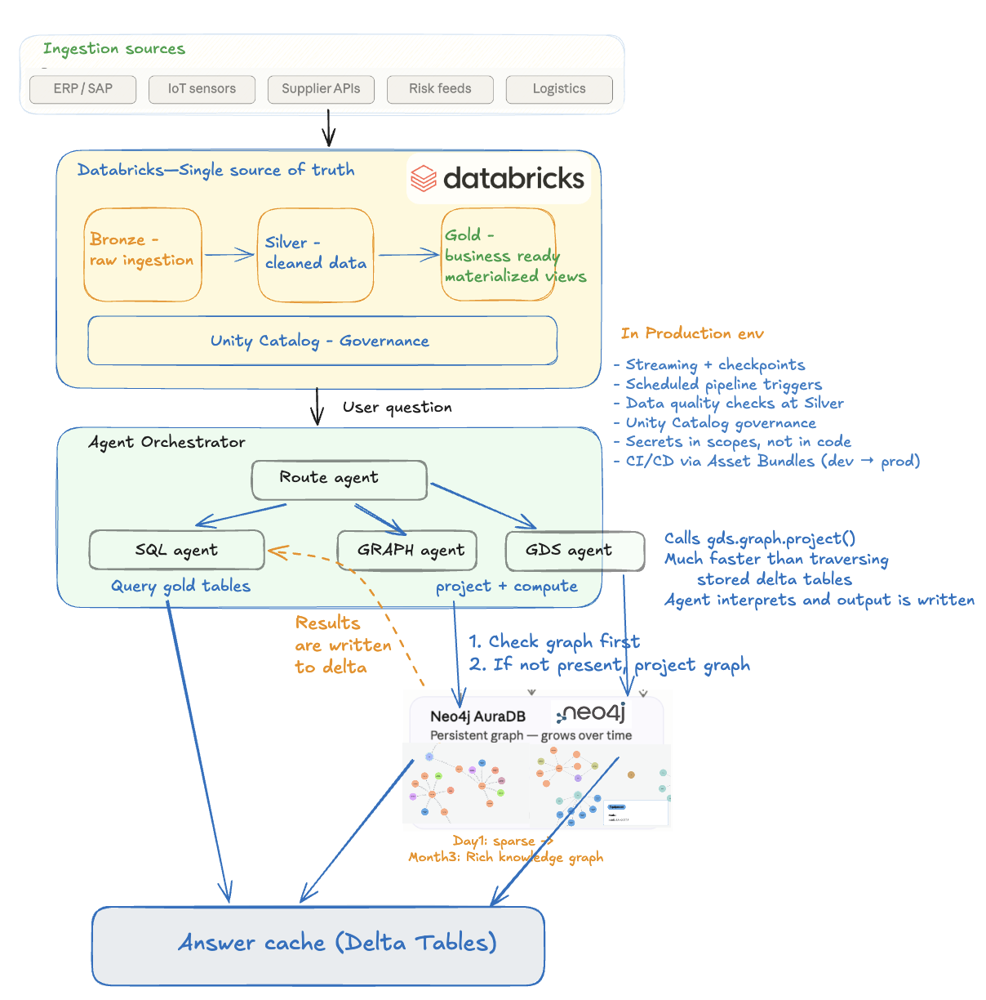

# Neo4j-Augmented Supply Chain Optimization on Databricks

An AI-powered supply chain risk and disruption analysis tool built on Databricks. Uses a multi-agent architecture to answer natural-language questions about supplier risk, part availability, shipment disruptions, and BOM dependencies — routing intelligently between SQL (Delta Lake), graph traversal (Neo4j AuraDB), and graph algorithms (Neo4j GDS) depending on the question type.

---

## Architecture



### Data Flow

```
Synthetic Data (Faker + Spark)
        ↓
/Volumes/supplychain/supply_chain_raw/landing/
        ↓
Lakeflow Spark Declarative Pipeline (Serverless)
        ↓
supplychain.supply_chain_medallion
  Bronze (6 streaming tables)  →  Silver (6 streaming tables)  →  Gold (5 materialized views)
        ↓                                                               ↓
  Raw ingestion                                              Agent Layer reads here
  Auto Loader from volume                                    + Neo4j subgraph projection
```

### Agent Layer

```
User Question
      ↓
  Router Agent (model-selectable)
      ├── route_to_sql   →  SQL Agent   →  spark.sql() on gold tables         →  Answer
      ├── route_to_graph →  Graph Agent →  project subgraph → Neo4j Cypher    →  Answer
      └── route_to_gds   →  GDS Agent   →  gds.graph.project() → algorithm    →  Answer
                                                      ↓
                                            Delta answer_cache (TTL 24h)
```

---

## Tech Stack

| Layer | Technology |
|-------|-----------|
| Data platform | Databricks (Serverless) |
| Storage | Delta Lake / Unity Catalog |
| Pipeline | Lakeflow Spark Declarative Pipelines (SQL) |
| Agent framework | Claude Opus 4.6 / Sonnet 4.6 / Haiku 4.5 (Anthropic SDK) — tool use, adaptive thinking |
| Graph algorithms | Neo4j GDS (PageRank, Betweenness Centrality, Louvain, Node Similarity, WCC, Dijkstra) |
| Graph database | Neo4j AuraDB |
| Application hosting | Databricks Apps (Serverless Compute) |
| UI framework | Gradio (`gr.ChatInterface`) |
| Orchestration | Databricks Asset Bundles (DAB) |
| Data generation | Spark + Faker + Pandas UDFs |

---

## Project Structure

```
supply-chain-optimizer/
├── README.md
├── databricks.yml                          # Databricks Asset Bundle config
├── requirements.txt                        # anthropic, neo4j, databricks-sdk
├── .env                                    # Credentials (gitignored)
│
├── resources/
│   └── supply_chain_pipeline.pipeline.yml  # SDP pipeline resource definition
│
├── data_gen/
│   ├── generate_supply_chain_data.py       # Local Spark data generator
│   └── generate_supply_chain_data_notebook.py  # Databricks notebook version
│
├── src/supply_chain_pipeline/transformations/
│   ├── bronze_suppliers.sql                # Auto Loader → bronze streaming tables
│   ├── bronze_parts.sql
│   ├── bronze_facilities.sql
│   ├── bronze_bom.sql
│   ├── bronze_purchase_orders.sql
│   ├── bronze_shipments.sql
│   ├── silver_suppliers.sql                # Typed + DQ constraints
│   ├── silver_parts.sql
│   ├── silver_facilities.sql
│   ├── silver_bom.sql
│   ├── silver_purchase_orders.sql
│   ├── silver_shipments.sql
│   ├── gold_supplier_risk.sql              # Composite risk score 0-100
│   ├── gold_part_availability.sql          # Stock status per part/facility
│   ├── gold_active_purchase_orders.sql     # Open/delayed POs with aging
│   ├── gold_shipment_pipeline.sql          # In-transit shipments + disruption severity
│   └── gold_bom_explosion.sql              # 2-level BOM with rolled-up cost
│
├── agents/
│   ├── config.py                           # All env vars and table names
│   ├── cache.py                            # Delta answer cache (local Python)
│   ├── prompts.py                          # System prompts + tool schemas
│   ├── router.py                           # Claude router agent (local Python)
│   ├── sql_agent.py                        # SQL agent (local Python)
│   ├── graph_agent.py                      # Graph agent (local Python)
│   └── supply_chain_agent_notebook.py      # All-in-one Databricks notebook
│
├── neo4j_graph/
│   ├── connector.py                        # Neo4j driver + subgraph projectors
│   └── queries.py                          # Pre-built Cypher query library
│
├── app/                                    # Databricks App (Serverless Compute)
│   ├── app.py                              # Gradio ChatInterface + router/SQL/graph agents
│   ├── app.yaml                            # Databricks Apps config (command + env vars)
│   └── requirements.txt                    # App dependencies (anthropic, neo4j, gradio, databricks-sdk)
│
└── main.py                                 # Local CLI entry point
```

---

## Data Model

### Synthetic Domain Entities

| Entity | Count | Key Fields |
|--------|-------|-----------|
| Suppliers | 200 | `SUP-XXXXX`, tier (Tier-1/2/3), reliability_score, country |
| Parts | 500 | `PRT-XXXXX`, category (Raw Material / Sub-Assembly / Component), is_critical |
| Facilities | 50 | `FAC-XXXXX`, facility_type (Manufacturing / Assembly / Warehouse), region |
| BOM | ~2,000 | `BOM-XXXXX`, parent→child part relationships |
| Purchase Orders | 8,000 | `PO-XXXXXXX`, status (Open / In-Transit / Received / Delayed / Cancelled) |
| Shipments | ~12,000 | `SHP-XXXXXXXX`, carrier (5 carriers, Pareto dist), delay_days |

### Gold Tables

| Table | Description |
|-------|-------------|
| `gold_supplier_risk` | Composite risk score (reliability 40% + PO problem rate 35% + shipment issues 25%), risk_tier |
| `gold_part_availability` | Ordered vs received qty per part/facility, stock_status |
| `gold_active_purchase_orders` | Open/delayed POs with aging buckets and exposure_score |
| `gold_shipment_pipeline` | In-transit/delayed shipments with disruption_severity and route_key |
| `gold_bom_explosion` | 2-level BOM flattening with cumulative_quantity and rolled_up_cost_usd |

### Neo4j Graph Schema

```
(:Supplier)-[:SUPPLIES {po_count, avg_delay_days}]->(:Part)
(:Part)-[:REQUIRES {quantity, depth}]->(:Part)
(:Supplier)-[:SHIPS_TO {carrier, route_key}]->(:Facility)
(:Shipment)-[:DEPARTS_FROM]->(:Supplier)
(:Shipment)-[:ARRIVES_AT]->(:Facility)
```

---

> [!TIP]
> **For Developers:** Want this running in your own Databricks workspace? The fastest path is the [Databricks AI Dev Kit](https://github.com/databricks-solutions/ai-dev-kit) — works with Claude Code or Cursor, handles scaffolding and deployment end-to-end. Manual steps below if you'd rather set it up yourself.

---

## Setup

### Prerequisites

| Requirement | Notes |
|-------------|-------|
| Databricks workspace | Serverless compute + Unity Catalog + Databricks Apps enabled |
| Databricks CLI | v0.200+ — install via `pip install databricks-cli` or [docs](https://docs.databricks.com/dev-tools/cli/index.html) |
| Python | 3.11+ (for local development) |
| Anthropic API key | Requires access to `claude-opus-4-6` model |
| Neo4j AuraDB instance | **Professional tier required** for GDS algorithms — note the URI, username, and password |
| Unity Catalog | `supplychain` catalog and `supply_chain_medallion` schema must exist before running the pipeline |

### 1. Store Secrets

```bash
databricks secrets create-scope supply_chain
databricks secrets put-secret supply_chain anthropic_api_key --string-value sk-ant-...
databricks secrets put-secret supply_chain neo4j_password    --string-value <password>
```

### 2. Generate Synthetic Data

Open `data_gen/generate_supply_chain_data_notebook.py` in Databricks and run all cells.  
Data lands at: `/Volumes/supplychain/supply_chain_raw/landing/`

### 3. Deploy and Run the Medallion Pipeline

```bash
databricks bundle deploy
databricks bundle run supply_chain_pipeline
```

### 4. Run the Agent Notebook

Open `agents/supply_chain_agent_notebook` in your Databricks workspace:
- **Run All** once to initialize
- Update the **Question** widget and run the last cell for each query

### 5. Deploy the Application on Databricks Apps (Serverless Compute)

The `app/` directory contains a Gradio chat application that runs entirely on Databricks serverless compute — no external hosting needed. It embeds the full router + SQL + graph + GDS agent stack, reads secrets directly from the Databricks secret scope, and includes a model selector (Opus / Sonnet / Haiku) and adaptive thinking toggle in the UI.

#### 5a. Upload and deploy

```bash
databricks workspace import-dir app /Workspace/Users/<your-email>/supply-chain-optimizer --overwrite
databricks apps deploy supply-chain-optimizer \
  --source-code-path /Workspace/Users/<your-email>/supply-chain-optimizer
```

#### 5b. Grant the app service principal permissions

After the first deploy, retrieve the app's service principal client ID:

```bash
databricks apps get supply-chain-optimizer -o json | python3 -c \
  "import sys,json; d=json.load(sys.stdin); print(d['service_principal_client_id'])"
```

Then grant it access to secrets and Unity Catalog:

```bash
SP=<service_principal_client_id>

# Secret scope
databricks secrets put-acl supply_chain "$SP" READ

# Unity Catalog
databricks grants update catalog supplychain \
  --json "{\"changes\": [{\"principal\": \"$SP\", \"add\": [\"USE CATALOG\"]}]}"
databricks grants update schema supplychain.supply_chain_medallion \
  --json "{\"changes\": [{\"principal\": \"$SP\", \"add\": [\"USE SCHEMA\", \"SELECT\"]}]}"
databricks grants update table supplychain.supply_chain_medallion.answer_cache \
  --json "{\"changes\": [{\"principal\": \"$SP\", \"add\": [\"MODIFY\"]}]}"
```

#### 5c. Re-deploying after code changes

```bash
databricks workspace import-dir app /Workspace/Users/<your-email>/supply-chain-optimizer --overwrite
databricks apps deploy supply-chain-optimizer \
  --source-code-path /Workspace/Users/<your-email>/supply-chain-optimizer
```

## Application Running on Databricks Apps (Serverless Compute)


---

## Agent Routing Logic

| Question Type | Route | Example |
|--------------|-------|---------|
| Risk scores, rankings | SQL | "Which suppliers have Critical risk?" |
| Stock status, availability | SQL | "What is the stock status for critical parts?" |
| PO aging, exposure | SQL | "Show delayed POs over 30 days old" |
| Shipment delays | SQL | "Which shipments have High disruption severity?" |
| BOM cost rollup | SQL | "What are the top 10 most expensive assemblies?" |
| Impact if X fails | **Graph** | "What parts are at risk if SUP-00094 fails?" |
| Dependency chains | **Graph** | "Which assemblies depend on this component?" |
| Single points of failure | **Graph** | "Which critical parts have only one supplier?" |
| Cascading disruptions | **Graph** | "What happens if all China suppliers are disrupted?" |
| Bottleneck / centrality | **GDS** | "Which parts are the biggest structural bottlenecks?" |
| Network-wide scoring | **GDS** | "Rank parts by how many assemblies depend on them (PageRank)" |
| Cluster / community detection | **GDS** | "Which supplier-part clusters are most exposed to risk?" |
| Node similarity | **GDS** | "Which suppliers have the most similar part portfolios?" |
| Weighted shortest path | **GDS** | "What is the least-delay sourcing path to this assembly?" |
| Disconnected components | **GDS** | "Are there isolated parts in the BOM?" |

---

## Progressive Graph Projection

The Neo4j graph is built lazily — subgraphs are projected from Delta gold tables on first use and persist in AuraDB across questions and app restarts. A live count query on AuraDB prevents re-loading data that already exists.

| Subgraph | Relationships Created | Source Tables |
|----------|----------------------|---------------|
| `supplier_risk` | `(:Supplier)-[:SUPPLIES]->(:Part)` | gold_supplier_risk, gold_part_availability, gold_active_purchase_orders |
| `bom_dependency` | `(:Part)-[:REQUIRES]->(:Part)` | gold_bom_explosion |
| `shipment_route` | `(:Supplier)-[:SHIPS_TO]->(:Facility)` | gold_shipment_pipeline |
| `full_network` | All of the above | All gold tables |

---

## GDS Graph Algorithms

GDS named graphs are in-memory projections created on top of the stored AuraDB data. Algorithms run entirely in RAM inside Neo4j — results are streamed back to the agent, never written to storage.

| GDS Projection | Nodes | Relationships | Algorithms |
|----------------|-------|---------------|------------|
| `bom_network` | Part | REQUIRES (weight: cumulative_quantity) | PageRank, Betweenness Centrality, WCC, Shortest Path |
| `supply_risk_network` | Supplier + Part | SUPPLIES (weights: po_count, avg_delay_days) | Node Similarity, Louvain Community Detection, Weighted Shortest Path |
| `facility_network` | Supplier + Facility | SHIPS_TO | Betweenness Centrality, Louvain, Shortest Path |

---

## Answer Cache

All agent responses are cached in `supplychain.supply_chain_medallion.answer_cache` (Delta table).

- **Key**: SHA-256 hash of the normalized question text
- **TTL**: 24 hours (configurable via `CACHE_TTL_HOURS`)
- **Hit tracking**: `hit_count` incremented on every cache read
- **Invalidation**: Automatic on TTL expiry; corrupt entries self-heal on read

---

## Example Questions

**SQL — Delta Lake**
```
Which suppliers have Critical risk scores?
Show me all delayed purchase orders over 30 days old
What are the top 10 most expensive BOM assemblies?
Which shipments have High or Critical disruption severity?
What is the stock status for critical parts?
```

**Graph — Neo4j Cypher traversal**
```
What parts are at risk if our highest-risk supplier fails?
Which critical parts have only a single supplier?
What assemblies would be affected if Tier-1 suppliers from China are disrupted?
Show me the most depended-upon components in the BOM network
Which carrier routes have the most disrupted shipments?
```

**GDS — Neo4j Graph Algorithms**
```
Which parts are the biggest structural bottlenecks in the BOM? (Betweenness Centrality)
Rank parts by how many assemblies depend on them using PageRank
Which suppliers have the most similar part portfolios? (Node Similarity)
Detect supplier-part communities — which clusters are most exposed to risk? (Louvain)
Which facilities are the most critical routing hubs in the shipment network?
Are there any isolated or disconnected parts in the BOM? (WCC)
```

---

## Roadmap

### Phase 4 — Richer Data Model & New Query Capabilities

The current dataset is sufficient for a compelling demo. The additions below would unlock the next tier of supply chain questions.

#### High-Value Column Additions

| Column | Table | Unlocks |
|--------|-------|---------|
| `lead_time_days` | Suppliers | "Which suppliers have both high risk AND long lead times?" |
| `contract_expiry_date` | Suppliers | "Which critical supplier contracts expire in the next 90 days?" |
| `on_time_delivery_rate` | Suppliers | More accurate risk score input than delay_days alone |
| `days_of_supply` | Part availability | "Which critical parts will stock out first?" |
| `substitute_part_id` | Parts | Graph query: find an alternative part when a component fails |

#### New Entity: Risk Events

A `risk_events` table mapping external disruptions (weather, port strikes, geopolitical events) to affected suppliers, facilities, or countries. This unlocks the most realistic supply chain question:

> *"What parts are at risk due to the port strike in Shanghai?"*

Would require:
- New synthetic data generator for risk events
- New bronze/silver/gold pipeline tables
- New graph edges: `(:RiskEvent)-[:AFFECTS]->(:Facility|:Supplier)`
- Router updated to recognize disruption-event questions

#### Impact on GDS

`substitute_part_id` would add a new relationship type `(:Part)-[:SUBSTITUTE_FOR]->(:Part)` enabling a new GDS projection for alternative sourcing path analysis (Dijkstra with fallback routing).

---

#### MLflow Tracing & Evaluation

The current agents are raw Anthropic SDK calls with no observability. MLflow integration would add three layers:

**1. MLflow Tracing** *(low effort, high value)*
Instrument every agent call to capture latency, token usage, tool calls, and routing decisions — giving a full audit trail of what Claude did on each question.
```python
import mlflow
mlflow.anthropic.autolog()  # traces all Claude API calls automatically
```

**2. MLflow Evaluation** *(medium effort)*
Run LLM-as-judge scoring across SQL, Graph, and GDS routes to automatically assess answer quality (correctness, relevance, completeness). Useful for comparing Sonnet vs Opus answer quality systematically.
```python
mlflow.evaluate(data=questions_df, model=agent, evaluators=["default"])
```

**3. Databricks Agent Framework** *(productionization)*
Wrap agents as proper MLflow models, serve via Databricks Model Serving endpoints, and register tools in Unity Catalog. Moves the agent stack out of the Gradio app into a production-grade serving layer.

> **Recommendation:** Add tracing first (instrumentation only, no code restructure needed), evaluation second, Agent Framework last if moving beyond demo.
